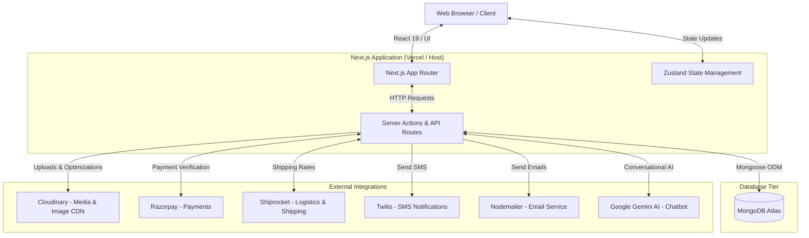
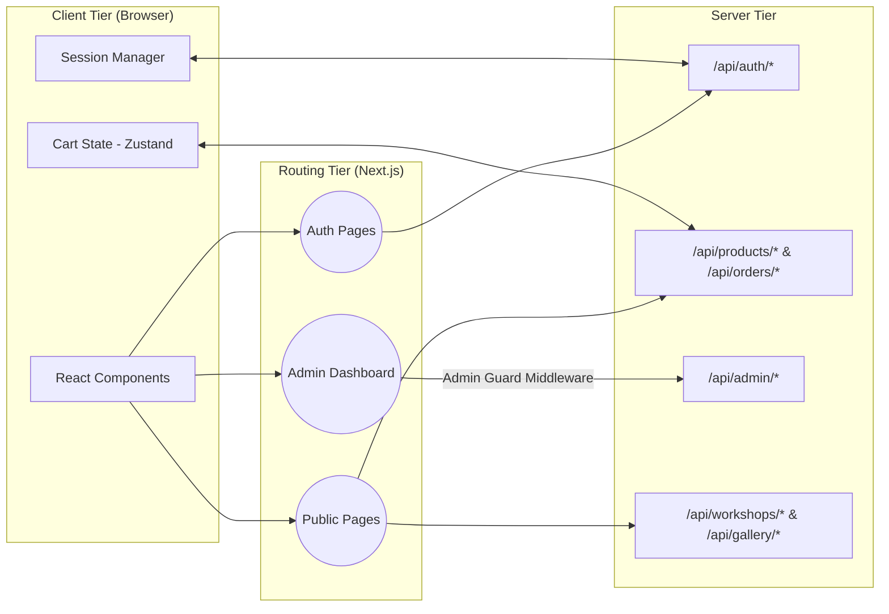
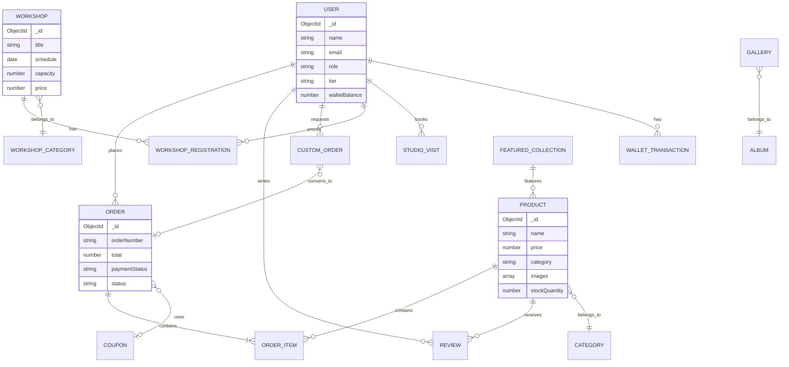

# 🏗️ Basho System Architecture

This document provides a comprehensive overview of the system architecture for the GWOC26 Basho E-Commerce Platform. It covers the high-level system integrations, application component flow, and the database entity-relationship model.

---

## 1. High-Level System Architecture

The platform follows a modern decoupled architecture centered around Next.js, with server-side logic handled via Next.js API routes and App Router actions. It integrates with various external SaaS providers for specialized capabilities.

---

## 2. Application Component Flow

This diagram illustrates how data flows internally within the Next.js frontend, separating client-side state from server-side rendering and administrative controls.

---

## 3. Entity-Relationship (ER) Data Model

The application utilizes MongoDB for data persistence. Below is the Entity-Relationship diagram showcasing how the primary models interact, including users, products, orders, and studio-specific features.

