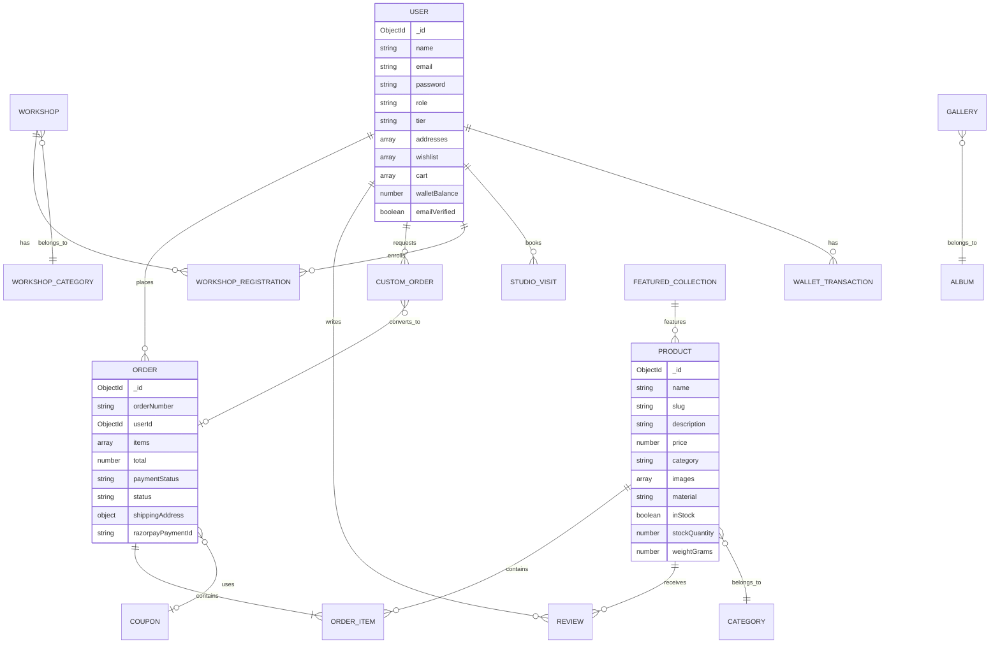
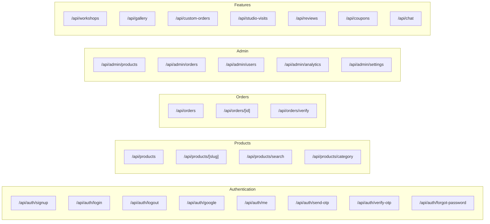
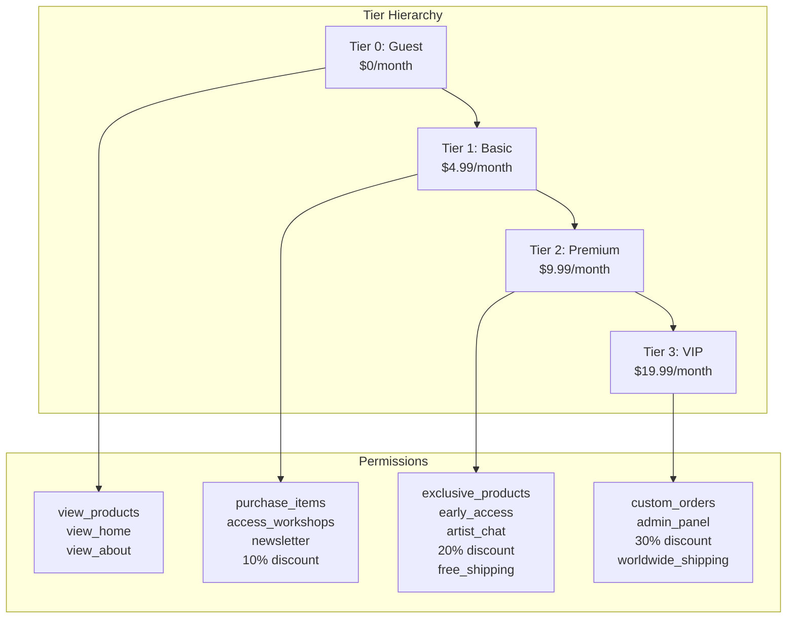
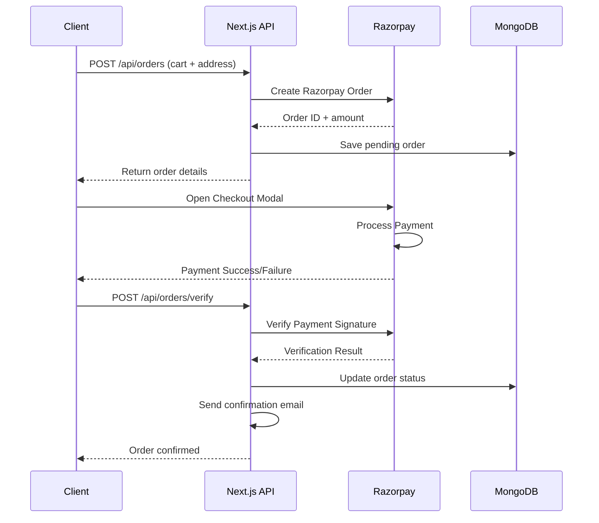
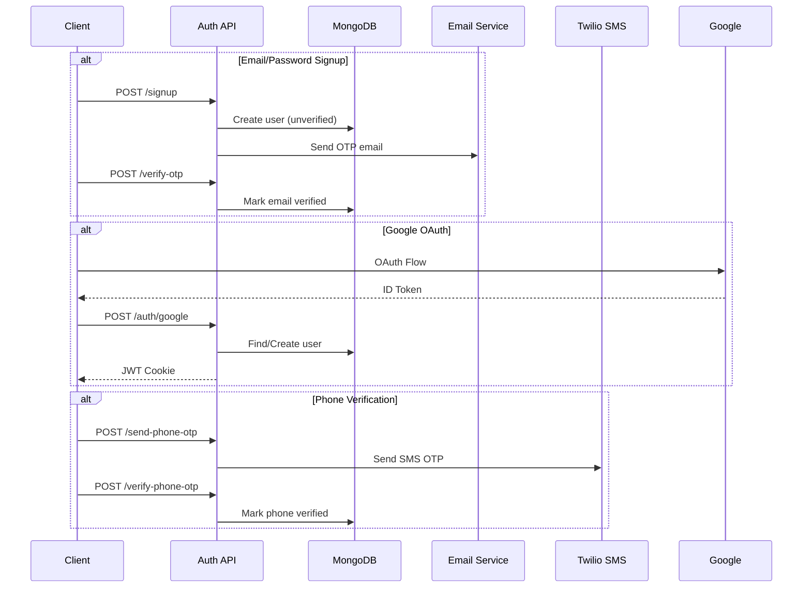
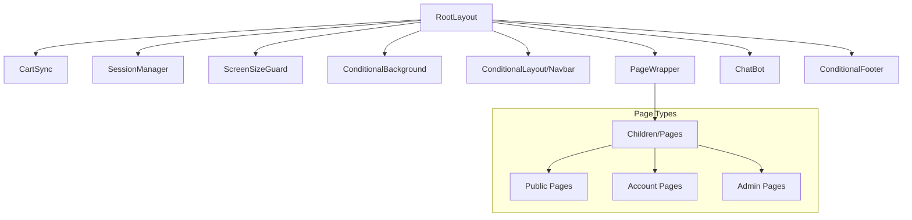
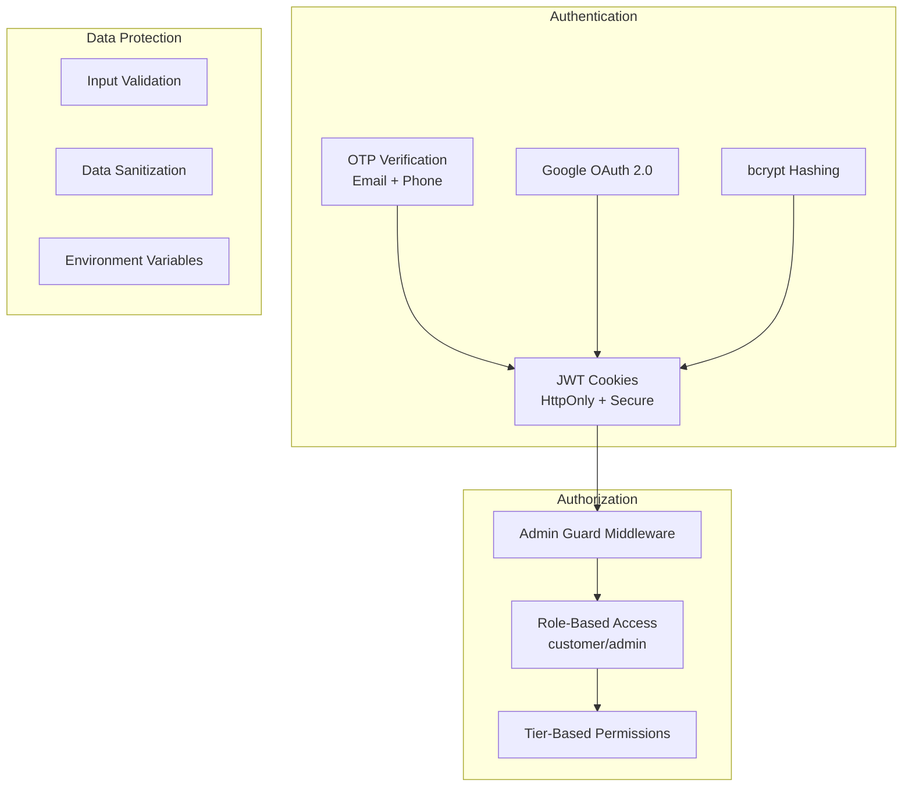
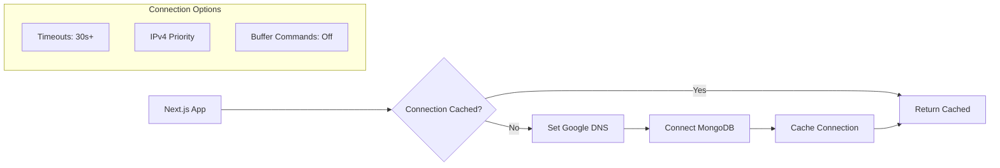

# Basho E-commerce Platform

Welcome to the GWOC26 Basho project! This is a modern e-commerce platform built with Next.js and TypeScript, designed for handcrafted Japanese-inspired pottery. This README reflects the latest project cleanup: **all files present are necessary for the core website and its features.**

---

## 🚀 Quick Overview

- **Tech Stack:** Next.js 16.1 (App Router), TypeScript, MongoDB Atlas, Tailwind CSS, Zustand, Razorpay, Cloudinary, Twilio, Nodemailer, Google Generative AI
- **Features:** Product catalog, user accounts, admin dashboard, workshops, gallery, payments, AI chatbot, and more
- **Audience:** Customers, admins, contributors, and developers

---

## 📦 Project Structure (What’s Inside)

The codebase is organized for clarity and scalability. All files and folders listed below are actively used or required for the website’s operation:

```
gwoc26/
├── src/
│   ├── app/         # Main app pages and API routes
│   ├── components/  # Reusable React components
│   ├── models/      # Database schemas (Mongoose)
│   ├── lib/         # Utility modules (auth, cart, email, etc.)
│   └── data/        # Static data (e.g., chatbot FAQs)
├── scripts/         # Utility scripts (database, admin, gallery management)
└── public/          # Static assets (images, icons, media)
```

**Note:** `.txt` and `.md` files are retained for documentation and linting purposes.

---

## 🛠️ Technology Stack (At a Glance)

| Layer            | Technology                | Purpose                    |
| ---------------- | ------------------------- | -------------------------- |
| Framework        | Next.js 16.1 (App Router) | Full-stack React framework |
| Language         | TypeScript                | Type-safe development      |
| Database         | MongoDB Atlas + Mongoose  | Document database & ODM    |
| Styling          | Tailwind CSS              | Utility-first CSS          |
| State Management | Zustand                   | Client-side state          |
| Animations       | Framer Motion             | UI animations              |
| Payments         | Razorpay                  | Indian payment gateway     |
| Media Storage    | Cloudinary                | Image/video CDN            |
| Email            | Nodemailer (Gmail)        | Transactional emails       |
| SMS              | Twilio                    | OTP & notifications        |
| AI               | Google Generative AI      | Chatbot assistant          |
| Icons            | Lucide React              | Icon library               |
| Charts           | Recharts                  | Admin analytics            |

---

## 🧹 Project Cleanup Status

All unused files (except `.txt` and `.md` documentation/lint files) have been removed. Every remaining file is required for:

- Website functionality
- Admin and database management
- Gallery and product management
- Static assets for UI/UX

Scripts in the `scripts/` folder are essential for database seeding, admin setup, and gallery operations. All files in `public/` are used for images, icons, and media.

---

## 🌐 How the System Works (Architecture)

The platform is built with a clear separation of concerns:

- **Client Layer:** Browser, payment SDKs, Google sign-in
- **Next.js Application:** Frontend pages, state management, API routes
- **External Services:** Database, CDN, payment gateway, email/SMS, AI

Mermaid diagrams are used throughout this README to visualize relationships and flows. (If you don’t see diagrams, try viewing on GitHub or a Markdown viewer that supports Mermaid.)

---

## 🏗️ Key Features & Modules

- **Products:** Browse, search, and purchase pottery items
- **User Accounts:** Signup, login, Google OAuth, tier system
- **Admin Panel:** Manage products, orders, users, analytics
- **Workshops & Studio Visits:** Book and manage events
- **Gallery:** View curated albums and media
- **Cart & Orders:** Add to cart, checkout, payment integration
- **Chatbot:** AI-powered assistant for FAQs and support
- **Security:** JWT, OTP, role/tier-based access, input validation

---

## 📝 Getting Started

1. **Clone the repo:**
   ```bash
   git clone <repo-url>
   cd gwoc26
   ```
2. **Install dependencies:**
   ```bash
   npm install
   ```
3. **Set up environment variables:**
   Copy `.env.example` to `.env` and fill in your secrets (MongoDB, Razorpay, Cloudinary, etc.)
4. **Run the development server:**
   ```bash
   npm run dev
   ```
5. **Explore the app:**
   - Visit `http://localhost:3000` in your browser
   - Try logging in, browsing products, and using the chatbot

---

## 🤝 Contributing & Support

- **New to the project?** Start by reading this README and exploring the `src` folder.
- **Want to contribute?** Fork the repo, make changes, and submit a pull request.
- **Need help?** Check the FAQ, use the chatbot, or contact the maintainers.

---

## 📚 More Details

For advanced users and developers, the following sections provide:

- Data model architecture and relationships
- API route structure and categories
- State management and persistence
- User tier system and permissions
- Payment and authentication flows
- Component and admin panel architecture
- External service integrations
- Security and deployment considerations

**Scroll down for technical diagrams, tables, and in-depth explanations.**

---

## 3. Directory Structure

```
gwoc26/
├── src/
│   ├── app/                    # Next.js App Router pages
│   │   ├── (auth)/             # Auth route group (login, signup)
│   │   ├── @modal/             # Parallel route for modals
│   │   ├── account/            # User account pages
│   │   ├── admin/              # Admin dashboard & management
│   │   ├── api/                # 23 API route groups
│   │   ├── blog/               # Blog pages
│   │   ├── cart/               # Shopping cart
│   │   ├── collections/        # Product collections
│   │   ├── gallery/            # Image/video gallery
│   │   ├── invoice/            # Invoice generation
│   │   ├── products/           # Product listings & details
│   │   ├── studio/             # Studio visit booking
│   │   ├── workshops/          # Workshop listings
│   │   └── layout.tsx          # Root layout
│   │
│   ├── components/             # 37 React components
│   │   ├── admin/              # Admin-specific components
│   │   ├── Navbar.tsx          # Main navigation
│   │   ├── ProductCard.tsx     # Product display
│   │   ├── ChatBot.tsx         # AI chatbot
│   │   └── ...
│   │
│   ├── models/                 # 30 Mongoose schemas
│   │   ├── User.ts             # User model with tiers
│   │   ├── Product.ts          # Product catalog
│   │   ├── Order.ts            # Order management
│   │   └── ...
│   │
│   ├── lib/                    # 16 utility modules
│   │   ├── mongodb.ts          # DB connection
│   │   ├── auth.ts             # Auth store
│   │   ├── cart.ts             # Cart store
│   │   ├── email.ts            # Email templates
│   │   ├── tiers.ts            # Tier system
│   │   └── ...
│   │
│   └── data/                   # Static data
│       └── chatbot-faqs.ts     # FAQ data for chatbot
│
├── scripts/                    # Utility scripts
│   └── seed-gallery.js         # Database seeding
│
└── public/                     # Static assets
```

---

## 4. Data Model Architecture

### Entity Relationship Diagram



### Complete Model List

| Model                    | Description              | Key Fields                                                  |
| ------------------------ | ------------------------ | ----------------------------------------------------------- |
| **User**                 | Customer/Admin accounts  | name, email, tier, addresses, cart, wishlist, walletBalance |
| **Product**              | Pottery items            | name, slug, price, category, material, dimensions, stock    |
| **Order**                | Purchase orders          | orderNumber, items, total, paymentStatus, shippingAddress   |
| **CustomOrder**          | Bespoke requests         | productType, budget, items, totalPrice, status              |
| **Workshop**             | Pottery workshops        | title, date, price, maxParticipants, enrolledCount, level   |
| **WorkshopRegistration** | Workshop bookings        | userId, workshopId, status, payment                         |
| **Gallery**              | Media items              | title, image, album, category, type (image/video)           |
| **Album**                | Gallery albums           | name, description, coverImage                               |
| **Review**               | Product reviews          | productId, userId, rating, comment                          |
| **StudioVisit**          | Visit bookings           | name, date, guests, purpose, status                         |
| **Coupon**               | Discount codes           | code, discountType, discountValue, usageLimit               |
| **Event**                | Calendar events          | title, date, type, description                              |
| **FeaturedCollection**   | Curated product groups   | name, products, featured                                    |
| **Contact**              | Contact form submissions | name, email, message, status                                |
| **Testimonial**          | Customer testimonials    | quote, author, rating                                       |
| **ShippingRate**         | Shipping pricing         | zone, weightRange, rate                                     |
| **PincodeRate**          | Pincode-based rates      | pincode, deliveryDays, rate                                 |
| **StudioInfo**           | Studio configuration     | address, hours, phone                                       |
| **StoreSettings**        | Store configuration      | tax, currency, shipping defaults                            |

---

## 5. API Architecture

### API Route Structure



### API Categories (23 Route Groups)

| Category          | Routes    | Purpose                                                    |
| ----------------- | --------- | ---------------------------------------------------------- |
| **auth**          | 11 routes | Authentication (login, signup, OAuth, OTP, password reset) |
| **admin**         | 26 routes | Admin CRUD operations                                      |
| **products**      | 4 routes  | Product catalog access                                     |
| **orders**        | 3 routes  | Order creation & management                                |
| **user**          | 9 routes  | User profile & preferences                                 |
| **workshops**     | 5 routes  | Workshop management                                        |
| **gallery**       | 1 route   | Gallery media                                              |
| **albums**        | 1 route   | Album management                                           |
| **custom-orders** | 4 routes  | Custom order workflow                                      |
| **studio-visits** | 1 route   | Visit bookings                                             |
| **reviews**       | 1 route   | Product reviews                                            |
| **coupons**       | 1 route   | Coupon validation                                          |
| **shipping**      | 1 route   | Shipping calculations                                      |
| **invoice**       | 2 routes  | Invoice generation                                         |
| **chat**          | 1 route   | AI chatbot                                                 |

---

## 6. Client-Side State Management

```mermaid
flowchart TB
    subgraph "Zustand Stores"
        AS[Auth Store<br/>basho-auth]
        CS[Cart Store<br/>basho-cart]
    end

    subgraph "Auth Store State"
        U[user: User | null]
        IA[isAuthenticated: boolean]
        L[login: function]
        LO[logout: function]
    end

    subgraph "Cart Store State"
        I[items: CartItem[]]
        AD[add: function]
        RM[remove: function]
        UQ[updateQty: function]
        CL[clear: function]
        T[total: function]
    end

    AS --> U
    AS --> IA
    AS --> L
    AS --> LO

    CS --> I
    CS --> AD
    CS --> RM
    CS --> UQ
    CS --> CL
    CS --> T

    L -.->|clears on user change| CL
    LO -.->|clears on logout| CL
```

### State Persistence

- **Auth Store**: Persisted to `localStorage` as `basho-auth`
- **Cart Store**: Persisted to `localStorage` as `basho-cart`
- **Cart Sync**: `CartSync` component syncs local cart with server on auth changes

---

## 7. User Tier System



---

## 8. Payment Flow



---

## 9. Authentication Flow



---

## 10. Component Architecture

### Layout Hierarchy



### Key Components

| Component          | Purpose           | Key Features                        |
| ------------------ | ----------------- | ----------------------------------- |
| **Navbar**         | Navigation        | Auth-aware, cart count, mobile menu |
| **ProductCard**    | Product display   | Image, price, add-to-cart, wishlist |
| **ProductModal**   | Product detail    | Full info, gallery, reviews         |
| **ChatBot**        | AI assistant      | Google GenAI powered, FAQ data      |
| **BookVisitModal** | Studio booking    | Date picker, form validation        |
| **OrderModal**     | Order details     | Status tracking, items list         |
| **CartSync**       | State sync        | Syncs localStorage cart with server |
| **SessionManager** | Auth persistence  | Validates JWT, refreshes session    |
| **TierBadge**      | User tier display | Visual tier indicator               |
| **Toast**          | Notifications     | Success/error messages              |

---

## 11. Admin Panel Architecture

```mermaid
graph TB
    subgraph "Admin Dashboard"
        DASH[Dashboard Home<br/>Analytics & Stats]
    end

    subgraph "Content Management"
        PROD[Products<br/>CRUD + Images]
        COLL[Collections<br/>Featured Groups]
        GAL[Gallery<br/>Media Management]
        BLOG[Blog<br/>Content Posts]
    end

    subgraph "Order Management"
        ORD[Orders<br/>Status + Tracking]
        CUST[Custom Orders<br/>Quote + Fulfill]
        SHIP[Shipping<br/>Rates + Zones]
    end

    subgraph "User Management"
        USR[Users<br/>List + Block]
        WALL[Wallet<br/>Credit + History]
        CONT[Contacts<br/>Inquiries]
    end

    subgraph "Workshop & Studio"
        WS[Workshops<br/>Schedule + Enroll]
        SV[Studio Visits<br/>Bookings]
        STU[Studio Settings<br/>Info + Hours]
    end

    subgraph "Configuration"
        SET[Settings<br/>Store Config]
        CPN[Coupons<br/>Discounts]
        FRM[Frames<br/>Display Frames]
    end

    DASH --> PROD
    DASH --> ORD
    DASH --> USR
    DASH --> WS
    DASH --> SET
```



---

## 12. External Service Integration

### Cloudinary (Media Storage)

- **Purpose**: Image/video upload and CDN delivery
- **Config**: `lib/cloudinary.ts`
- **Features**: Auto-optimization, responsive images, transformations

### Razorpay (Payments)

- **Purpose**: Indian payment gateway
- **Config**: `lib/razorpay.ts`
- **Features**: UPI, cards, netbanking, wallets

### Twilio (SMS)

- **Purpose**: OTP and notifications
- **Config**: `lib/sms.ts`
- **Features**: Phone verification, order updates

### Nodemailer (Email)

- **Purpose**: Transactional emails
- **Config**: `lib/email.ts`
- **Templates**: OTP, order confirmation, status updates, refunds, wallet credits, marketing

### Google Generative AI

- **Purpose**: AI-powered chatbot
- **Component**: `ChatBot.tsx`
- **Data**: `data/chatbot-faqs.ts`

---

## 13. Security Architecture



### Security Features

- **Password Hashing**: bcryptjs with auto-salt
- **JWT Tokens**: HttpOnly cookies, server-side validation
- **OTP System**: Time-limited, single-use codes
- **Admin Guard**: Middleware protects admin routes
- **CORS**: Next.js built-in protection
- **Environment Variables**: Secrets stored in `.env`

---

## 14. Database Connection



**Key Features:**

- Connection caching for serverless
- Google DNS fallback (8.8.8.8)
- Extended timeouts for unstable networks
- IPv4 prioritization

---

## 15. Deployment Considerations

### Environment Variables Required

```env
# Database
MONGODB_URL=mongodb+srv://...

# Authentication
JWT_SECRET=...
NEXTAUTH_SECRET=...

# Google OAuth
GOOGLE_CLIENT_ID=...
GOOGLE_CLIENT_SECRET=...

# Razorpay
RAZORPAY_KEY_ID=...
RAZORPAY_KEY_SECRET=...

# Cloudinary
CLOUDINARY_CLOUD_NAME=...
CLOUDINARY_API_KEY=...
CLOUDINARY_API_SECRET=...

# Email
EMAIL_SERVICE=gmail
EMAIL_USER=...
EMAIL_PASSWORD=...

# Twilio
TWILIO_ACCOUNT_SID=...
TWILIO_AUTH_TOKEN=...
TWILIO_PHONE_NUMBER=...

# Google AI
GOOGLE_AI_API_KEY=...
```

### Build Commands

```bash
npm run dev     # Development server (Turbopack disabled)
npm run build   # Production build
npm run start   # Production server
npm run lint    # ESLint check
```

---

## Summary

**Basho** is a full-featured e-commerce platform built for a handcrafted pottery business, featuring:

- **30 data models** covering users, products, orders, workshops, and more
- **23 API route groups** with comprehensive CRUD operations
- **4-tier subscription system** with progressive permissions
- **Integrated payment, email, SMS, and AI services**
- **Admin dashboard** for complete business management
- **Modern UI** with animations and responsive design

The architecture follows Next.js 16 App Router patterns with server components, API routes, and client-side state management via Zustand.
