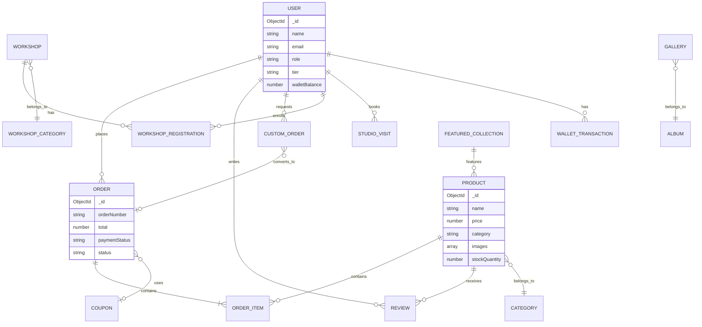
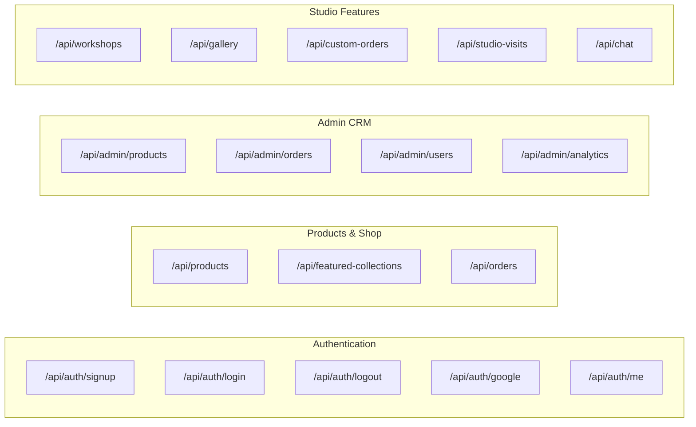

# Basho E-commerce Platform

Welcome to the GWOC26 Basho project! This is a modern, high-performance e-commerce platform built with Next.js and TypeScript, designed for handcrafted Japanese-inspired pottery.

---

## 🚀 Tech Stack

- **Framework:** Next.js 16.1 (App Router)
- **Language:** TypeScript
- **Database:** MongoDB Atlas + Mongoose
- **Styling:** Tailwind CSS + Framer Motion
- **State Management:** Zustand
- **Media Delivery:** Cloudinary + `next/image`
- **Payments:** Razorpay
- **Notifications:** Twilio (SMS), Nodemailer (Email)
- **AI Integration:** Google Generative AI

---

## ✨ Key Features & Recent Optimizations

- **Optimized Image Delivery:** Built-in Cloudinary URL transformations with native Next.js `<Image>` components to eliminate layout shifts and reduce loading times. Images load directly from Cloudinary's global CDN, bypassing local proxy bottlenecks.
- **Robust API Error Handling:** Graceful fallbacks on all major pages ensure the UI never crashes if the database or API routes fail.
- **Dynamic Shop & Gallery:** Filterable product catalogs, masonry gallery grid, and workshop booking system.
- **User Accounts:** Tier-based loyalty system, wishlist, and cart state management.
- **Admin Dashboard:** Full CRM capabilities to manage inventory, frames, collections, and custom orders.

---

## 📝 Getting Started

1. **Clone the repo & Install Dependencies:**
   ```bash
   git clone <repo-url>
   cd gwoc26
   npm install
   ```

2. **Environment Variables:**
   Create a `.env` file in the root directory and add your credentials:
   ```env
   MONGODB_URL=your_mongodb_connection_string
   CLOUDINARY_URL=your_cloudinary_url
   # Add other required API keys for Razorpay, Twilio, Gemini, etc.
   ```

3. **Run the Development Server:**
   ```bash
   npm run dev
   ```

   **Note for Windows Users:** If you experience `500 Internal Server Errors` across all API routes accompanied by a Turbopack `os error 80` panic, stop the server, delete the `.next` folder, and restart the server.

4. **Explore the App:**
   Visit `http://localhost:3000` to view the application.

---

## 🏗️ Data Model Architecture

The platform's database structure uses Mongoose and is built to handle complex e-commerce interactions.



---

## 🔌 API Architecture

The application is structured into domain-specific API route groups for scalability.

